# 🏆 FIFA World Cup 2026 App — Step-by-Step Implementation Plan

> **App Name:** ফিফা ওয়ার্ল্ড কাপ ২০২৬ সময়সূচী  
> **Platform:** Flutter Android  
> **Target:** Google Play Store  
> **Audience:** Bangladeshi football fans  
> **Language:** Bengali (বাংলা)

---

## Overview

This plan breaks the entire app build into **12 self-contained steps**. After each step, I'll stop and wait for your "proceed" before moving to the next. Each step produces something testable.

```mermaid
graph LR
    S1[Step 1: Project Setup] --> S2[Step 2: Design System]
    S2 --> S3[Step 3: Data Layer]
    S3 --> S4[Step 4: Splash Screen]
    S4 --> S5[Step 5: Nav Drawer]
    S5 --> S6[Step 6: Home Screen]
    S6 --> S7[Step 7: Teams + Groups]
    S7 --> S8[Step 8: Match Schedule]
    S8 --> S9[Step 9: Stadiums]
    S9 --> S10[Step 10: Point Table]
    S10 --> S11[Step 11: History + Players]
    S11 --> S12[Step 12: Ads + Polish]
```

---

## Step 1: Project Setup & Configuration

**What we do:**
- Create Flutter project: `flutter create --org com.worldcup2026 --project-name worldcup_2026_bd ./`
- Set up `pubspec.yaml` with all required packages
- Configure `AndroidManifest.xml` (permissions: INTERNET, notifications, boot)
- Set package name to `com.worldcup2026.bangladesh`
- Set min SDK 21, target SDK 34
- Create the folder structure (`lib/core/`, `lib/data/`, `lib/models/`, `lib/screens/`, `lib/widgets/`)

**Files created:**
- `pubspec.yaml` — updated with all dependencies
- `android/app/src/main/AndroidManifest.xml` — permissions added
- Empty folder structure under `lib/`

**Testable result:** `flutter run` shows default Flutter app with no errors

---

## Step 2: Design System (Constants & Theme)

**What we do:**
- Create `AppColors` class with all color tokens from Stitch designs
- Create `AppTextStyles` class with Hind Siliguri typography
- Create `AppStrings` class with all Bengali strings
- Create `app_theme.dart` with the MaterialApp theme (dark maroon theme)
- Set up `app.dart` with MaterialApp and named routes
- Utility: `number_to_bengali.dart` (1→১, 2→২, etc.)
- Utility: `time_converter.dart` (UTC → BST = UTC+6, with Bengali time format)

**Key colors (from Stitch files):**
| Token | Hex | Usage |
|---|---|---|
| `bgDark` | `#560027` | Main background |
| `bgMedium` | `#880E4F` | App bar, drawer |
| `bgCard` | `#9C1A55` | Match cards |
| `pink` | `#C2185B` | Buttons |
| `pinkLight` | `#BC477B` | Card labels |
| `gold` | `#FFD700` | Highlights, VS |
| `cyan` | `#00BCD4` | Stadium info |
| `background` | `#1a1113` | Teams screen base |
| `primaryContainer` | `#800021` | Hero gradients |

**Files created:**
- `lib/core/constants/app_colors.dart`
- `lib/core/constants/app_text_styles.dart`
- `lib/core/constants/app_strings.dart`
- `lib/core/utils/number_to_bengali.dart`
- `lib/core/utils/time_converter.dart`
- `lib/app.dart`

**Testable result:** App launches with maroon theme, Bengali text renders correctly

---

## Step 3: Data Layer (Excel → Dart)

**What we do:**
- Read all 5 Excel files and convert data into Dart hardcoded data classes
- Create models: `MatchModel`, `TeamModel`, `PlayerModel`, `StadiumModel`
- Create data files with all the static data:
  - `matches_data.dart` — 104 matches with BST times pre-calculated
  - `teams_data.dart` — 48 teams with Bengali names, flag emoji/URLs, group assignments
  - `groups_data.dart` — 12 groups (A–L) × 4 teams
  - `players_data.dart` — Squad lists from Excel
  - `stadiums_data.dart` — 17 stadiums with capacity, city, year, description
  - `history_data.dart` — World Cup winners 1930–2022

**Data sources:**
| Excel File | → Dart File |
|---|---|
| `FIFA2026_01_Teams_and_Groups.xlsx` | `teams_data.dart`, `groups_data.dart` |
| `FIFA2026_02_Historical_Winners.xlsx` | `history_data.dart` |
| `FIFA2026_03_Player_Squads.xlsx` | `players_data.dart` |
| `FIFA2026_04_Stadiums.xlsx` | `stadiums_data.dart` |
| `FIFA_2026_সম্পূর্ণ_১০৪_ম্যাচ_Final.xlsx` | `matches_data.dart` |

**Files created:**
- `lib/models/match_model.dart`
- `lib/models/team_model.dart`
- `lib/models/player_model.dart`
- `lib/models/stadium_model.dart`
- `lib/data/matches_data.dart`
- `lib/data/teams_data.dart`
- `lib/data/groups_data.dart`
- `lib/data/players_data.dart`
- `lib/data/stadiums_data.dart`
- `lib/data/history_data.dart`

**Testable result:** App compiles, data classes instantiate without errors

---

## Step 4: Splash Screen

**What we do:**
- Create `SplashScreen` widget
- Background: gradient `#560027 → #C2185B`
- Center: Trophy icon + "ফিফা ওয়ার্ল্ড কাপ ২০২৬" text
- Fade-in + scale-up animation (300ms)
- Auto-navigate to HomeScreen after 1.5 seconds
- Set as initial route

**Files created:**
- `lib/screens/splash/splash_screen.dart`

**Testable result:** App opens with animated splash, navigates to home

---

## Step 5: Navigation Drawer

**What we do — Replicate `stitch_designs/navigation bar/code.html` EXACTLY:**
- Width: 80% of screen
- Background: `#880E4F` (brand maroon)
- Header: "বিশ্বকাপ ২০২৬" title + "অফিসিয়াল অ্যাপ" subtitle + close button
- 5 main nav items with icons:
  - 📅 সময়সূচী → ScheduleScreen
  - 👥 গ্রুপসমূহ → GroupsScreen
  - 🌍 দলসমূহ → TeamsScreen
  - 🏟 স্টেডিয়াম → StadiumsScreen
  - 📊 হাইলাইটস → HighlightsScreen
- Divider section
- ⭐ ৫ স্টার রেট দিন / 📤 অ্যাপটি শেয়ার করুন
- Footer: বাগ রিপোর্ট / মতামত ও পরামর্শ / সেটিংস / লগ আউট
- Hover state: `#BC477B` at 10% opacity

**Files created:**
- `lib/widgets/nav_drawer.dart`

**Testable result:** Hamburger menu opens drawer matching the Stitch design screenshot

---

## Step 6: Home Screen

**What we do — Replicate `stitch_designs/Home Screen/code.html` EXACTLY:**

- **App Bar:** `#880E4F`, hamburger icon → drawer, title "বিশ্বকাপ ফুটবল সময়সূচী ২০২৬"
- **Hero Banner:** Full-width card with image + "ম্যাচ এবং সময়সূচী" label
- **Grid Menu (2 columns):** 7 cards with images + Bengali labels:
  - ম্যাচ এবং সময়সূচী (full width)
  - গ্রুপসমূহ | দলসমূহ
  - স্টেডিয়াম | ভ্রমণ স্থান
  - খেলোয়াড় | হাইলাইটস
  - পয়েন্ট টেবিল | ইতিহাস
- Card specs: height 160dp, radius 24dp, image cover + dark overlay, label `#BC477B`
- Tap → ripple → navigate to screen
- **"আজকের ম্যাচ"** horizontal scroll section
- **Countdown timer** to tournament start

> [!IMPORTANT]
> Background gradient: `#4a041c → #2d0211`  
> Cards: `#b00b46` background  
> This matches the Stitch design exactly.

**Files created:**
- `lib/screens/home/home_screen.dart`
- `lib/widgets/countdown_timer_widget.dart`

**Testable result:** Home screen looks like the Stitch screenshot, all cards navigate to screens

---

## Step 7: Teams Screen + Groups Screen + Team Detail

**What we do:**

### Teams Screen — Replicate `stitch_designs/Teams All/code.html` EXACTLY
- App bar: "দলসমূহ" + back arrow + search icon
- Background: `#1a1113` with gradient from `#800021`
- 2-column grid of all 48 teams
- Each card: **horizontal layout** (flag circle 40×40 + team name)
  - White background, `24px` border radius
  - Flag: circular, `border-slate-100`
  - Name: `text-slate-900`, bold, Hind Siliguri
  - Press: `scale-95` feedback
- Tap → TeamDetailScreen

### Groups Screen
- App bar: "গ্রুপ সমূহ"
- For each group A→L:
  - Header: "গ্রুপ A" (gold `#FFD700`, bold)
  - 2-column team grid (same card style as Teams screen but smaller)
  - Tap → TeamDetailScreen

### Team Detail Screen
- Large flag header
- Team name (Bengali, bold, 24sp)
- Group badge (cyan pill)
- Position filter tabs: সকলে | গোলরক্ষক | ডিফেন্ডার | মিডফিল্ডার | ফরোয়ার্ড
- Player list from `players_data.dart`

**Files created:**
- `lib/screens/teams/teams_screen.dart`
- `lib/screens/teams/team_detail_screen.dart`
- `lib/screens/groups/groups_screen.dart`

**Testable result:** Teams grid, groups list, and player details all working

---

## Step 8: Match Schedule Screen

**What we do:**
- App bar: "ম্যাচ এবং সময়সূচী"
- **Tab bar** (horizontally scrollable, sticky):
  - গ্রুপ স্টেজ | রাউন্ড অব ৩২ | রাউন্ড অব ১৬ | কোয়ার্টার ফাইনাল | সেমি ফাইনাল | ফাইনাল
  - Active tab: yellow pill `#FFD700`
  - Inactive: white text
- **Match cards** for each of 104 matches:
  - Match number badge (yellow pill)
  - Group badge (cyan)
  - Team flags (36dp) + Bengali names + "VS" (gold)
  - Date (Bengali) + Time (BST, Bengali)
  - Stadium name (cyan)
  - Card bg: `#9C1A55`, radius 16dp
- Knockout: "নির্ধারিত হবে" for TBD teams
- Search bar: filter by team, stadium, date

**Files created:**
- `lib/screens/schedule/schedule_screen.dart`
- `lib/screens/schedule/widgets/match_card_widget.dart`

**Testable result:** Full schedule with tabs, search, all 104 matches displayed

---

## Step 9: Stadiums Screen + Stadium Detail

**What we do:**

### Stadiums List
- App bar: "স্টেডিয়াম"
- Full-width cards (180dp height) with stadium photos
- Gradient overlay on bottom 50%
- Stadium name (white, bold) + City (gray)
- Radius 16dp, tap → detail

### Stadium Detail
- Full hero image (220dp)
- Back arrow overlay
- Stadium name (28sp, white)
- City (cyan `#00BCD4`)
- 4 info cards:
  - 📍 অবস্থান
  - 🪑 ধারণক্ষমতা (Bengali numbers)
  - 📅 উদ্বোধন
  - ⚽ ফিক্সচার
- Info card bg: `#7B1040`, icon bg: `#8D4E35`
- "স্টেডিয়াম সম্পর্কে" description

**Files created:**
- `lib/screens/stadiums/stadiums_screen.dart`
- `lib/screens/stadiums/stadium_detail_screen.dart`

**Testable result:** 17 stadiums listed, detail screen with all info cards

---

## Step 10: Point Table (Live API)

**What we do:**
- App bar: "পয়েন্ট টেবিল"
- **Live data** from `football-data.org` API
  - Endpoint: `https://api.football-data.org/v4/competitions/WC/standings`
  - 5-minute TTL cache via SharedPreferences
  - Pull-to-refresh
  - Offline fallback: cached data + "অফলাইন মোড" badge
- Table per group (A→L):
  - Columns: দল | খেলা | জয় | ড্র | হার | গোল+ | গোল- | গোব্যব | পয়েন্ট
  - Top 2: green left border
  - Bengali numbers throughout
- Before tournament: show all zeros
- "শেষ আপডেট: X মিনিট আগে" timestamp

**Files created:**
- `lib/screens/point_table/point_table_screen.dart`
- `lib/models/standing_model.dart`
- `lib/core/services/standings_api.dart`
- `lib/core/services/cache_service.dart`
- `lib/widgets/loading_shimmer.dart`

**Testable result:** Point table shows data (cached/live), pull-to-refresh works

---

## Step 11: History Screen + Players Screen

**What we do:**

### History Screen
- App bar: "কে কতবার বিজয়ী" (Blue bg `#1565C0`)
- Winner cards (white, shadow):
  - Flag + Country name
  - "উইনার্স: X বার" + star emojis
  - "রানার্স-আপ: X বার"
- Full history table: Year | Host | Champion | Runner-up | Score
- Data from `history_data.dart`

### Players Screen (standalone)
- Browse all teams → view squads
- Position filter tabs
- Player cards with jersey number, name, position

**Files created:**
- `lib/screens/history/history_screen.dart`
- `lib/screens/players/players_screen.dart`

**Testable result:** History from 1930–2022 displayed, players browsable

---

## Step 12: Monetization, Notifications & Polish

**What we do:**

### AdMob Integration
- Banner ads: bottom of every screen (adaptive)
- Native ads: every 8th match card, every 10th team card, every 3rd group
- Interstitial: on Point Table entry (max 1 per 3 minutes)
- Test IDs during development

### Local Notifications
- Schedule 30-minute-before reminders for all group stage matches
- Bengali notification text: "⚽ ম্যাচ শুরু হতে ৩০ মিনিট বাকি!"
- No Firebase needed, fully offline

### 5-Star Rating System
- Triggers: 5th launch, 2+ min session, or 10+ cards viewed
- 7-day cooldown after dismiss
- Trophy dialog with star buttons

### Final Polish
- App icon (512×512, trophy on maroon `#560027`)
- Loading shimmers everywhere
- Performance optimization (ListView.builder, const, RepaintBoundary)
- About screen

**Files created:**
- `lib/core/utils/ad_manager.dart`
- `lib/widgets/ad_banner_widget.dart`
- `lib/core/services/notification_service.dart`
- `lib/widgets/rating_dialog.dart`
- `lib/screens/about/about_screen.dart`

**Testable result:** Ads showing (test), notifications scheduled, rating popup working

---

## Summary Table

| Step | What Gets Built | Screens/Files |
|---|---|---|
| **1** | Project scaffold | pubspec, manifest, folders |
| **2** | Colors, fonts, theme | 6 core files |
| **3** | All data from Excel | 6 data + 4 model files |
| **4** | Splash screen | 1 screen |
| **5** | Navigation drawer | 1 widget |
| **6** | Home screen | 1 screen + 1 widget |
| **7** | Teams + Groups + Detail | 3 screens |
| **8** | Match schedule + tabs | 1 screen + 1 widget |
| **9** | Stadiums + detail | 2 screens |
| **10** | Live point table | 1 screen + 3 services |
| **11** | History + Players | 2 screens |
| **12** | Ads, notifications, rating | 5 files + polish |

> [!NOTE]
> Each step is designed to be **self-contained and testable**. You can review the output after each step before saying "proceed" to move to the next.

---

## Open Questions

> [!IMPORTANT]
> 1. **Flutter SDK** — Do you already have Flutter installed on your machine? Which version? (I need to make sure compatibility)
> 2. **Android Studio / Emulator** — Do you have an Android emulator or physical device set up for testing?
> 3. **Flag images** — The Stitch designs use Google-hosted images. Shall I use those same URLs, or would you prefer emoji flags (🇦🇷, 🇧🇷, etc.) which work offline?
> 4. **AdMob app ID** — Do you have a real AdMob account/app ID, or shall we use test IDs throughout and you'll swap later?
> 5. **Do you want me to start with Step 1 right away, or do you want changes to this plan first?**
